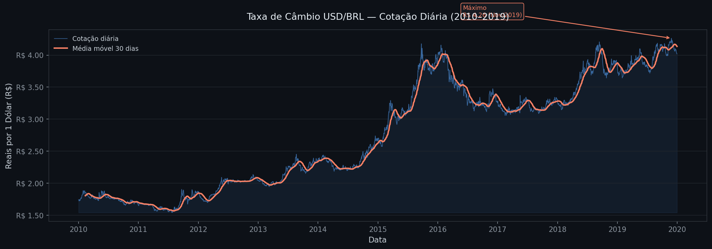
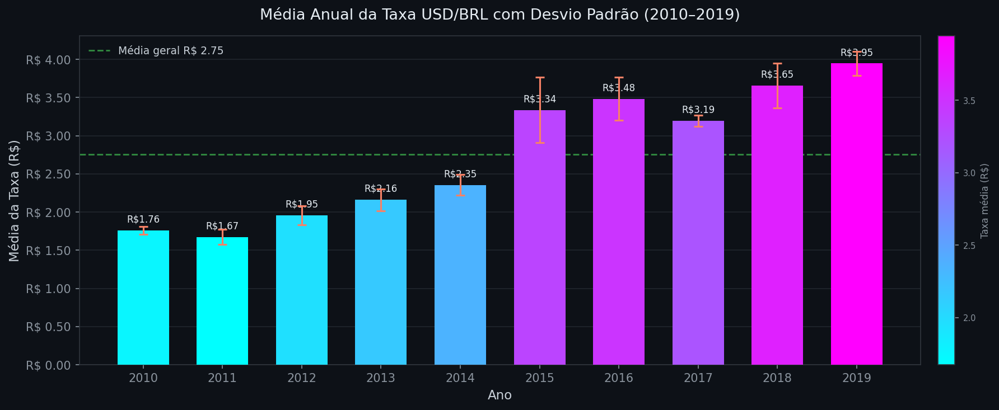
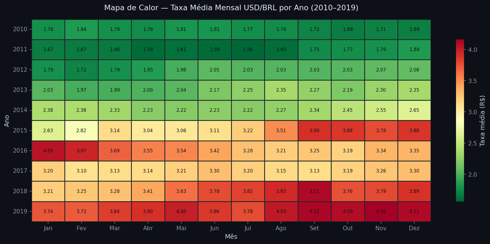

# Visualização da Informação — Projeto da Disciplina

> Projeto da disciplina de **Visualização da Informação** — UNICSUL  
> Três técnicas de visualização aplicadas a um dataset real de câmbio USD/BRL (2010–2019)

---

## 📊 Dataset

**Taxa de Câmbio USD/BRL — Cotações Diárias (2010–2019)**

| Atributo | Valor |
|---|---|
| Fonte | [Investing.com](https://br.investing.com/currencies/usd-brl-historical-data) |
| Período | 01/01/2010 — 31/12/2019 |
| Registros | ~2.608 |
| Colunas | `Data` (DD.MM.AAAA), `USD_BRL` (taxa de câmbio) |
| Mínimo histórico | R$ 1,72 |
| Máximo histórico | R$ 4,19 (set/2015) |

---

## 📁 Estrutura do Repositório

```
├── visualizacao_usd_brl.ipynb   # Código principal (Python)
├── USD_BRL_hist.csv             # Dataset
├── images/
│   ├── grafico1_linha_temporal.png
│   ├── grafico2_barras_estatistica.png
│   └── grafico3_heatmap_mensal.png
└── README.md
```

---

## 🛠️ Tecnologias

- Python 3.x
- [Pandas](https://pandas.pydata.org/) — carregamento e manipulação dos dados
- [Matplotlib](https://matplotlib.org/) — gráficos de linhas e barras
- [Seaborn](https://seaborn.pydata.org/) — heatmap

### Instalação

```bash
pip install pandas matplotlib seaborn
```

---

## 📈 Visualizações

### 1. Gráfico de Linhas — Visualização Temporal

> **Unidade:** Visualização de Informação Temporal

Série temporal diária da taxa USD/BRL com média móvel de 30 dias. A linha azul representa as cotações brutas e a linha laranja suaviza o ruído diário, evidenciando tendências de médio prazo. A anotação destaca o pico histórico de **R$ 4,19** em setembro de 2015, período da crise política e econômica brasileira.



---

### 2. Gráfico de Barras — Estatística Descritiva

> **Unidade:** Visualização com Gráficos da Estatística Descritiva

Média anual da taxa USD/BRL com barras de erro (±1 desvio padrão). A escala de cor codifica o valor médio de cada ano (frio → quente = barato → caro) e a linha tracejada indica a média geral do período (R$ 2,75). Os anos 2015 e 2018 apresentam as maiores barras de erro, evidenciando maior volatilidade cambial.



---

### 3. Heatmap Mensal — Visualização Relacional

> **Unidade:** Visualização de Informação Hierárquica / Relacional

Mapa de calor com a taxa média para cada combinação Ano × Mês. O colormap `RdYlGn` invertido codifica valores baixos em verde e altos em vermelho. Permite identificar simultaneamente padrões sazonais mensais e a tendência de desvalorização acumulada do real ao longo da década.



---

## ▶️ Como executar

1. Clone o repositório:
```bash
git clone https://github.com/LRebonatto/data-visualization
cd seu-repositorio
```

2. Instale as dependências:
```bash
pip install pandas matplotlib seaborn
```

3. Abra o notebook:
```bash
jupyter notebook visualizacao_usd_brl.ipynb
```

4. Execute todas as células com **Kernel → Restart & Run All**

---

## 🎥 Apresentação

Vídeo de apresentação técnica e conceitual do projeto:  
📺 [Assistir no YouTube](https://www.youtube.com/watch?v=Wf5OFS0tNRk)

---

## 📌 Conclusões

Os três gráficos são complementares e respondem perguntas diferentes sobre o mesmo dataset:

- **Linhas** — *O que* aconteceu ao longo do tempo? Revela a trajetória e eventos pontuais.
- **Barras** — *Quanto* cada ano variou? Quantifica médias e dispersão com rigor estatístico.
- **Heatmap** — *Quando* dentro de cada ano? Expõe sazonalidade e tendência de longo prazo.

---

## 📄 Licença

Projeto acadêmico — UNICSUL · Disciplina de Visualização da Informação